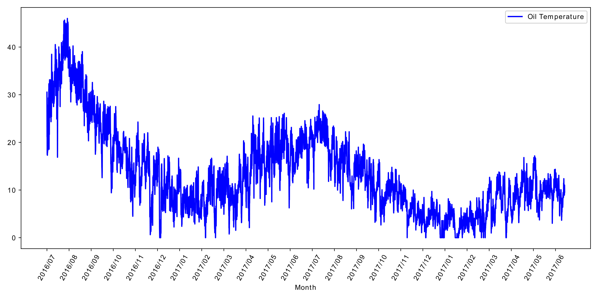
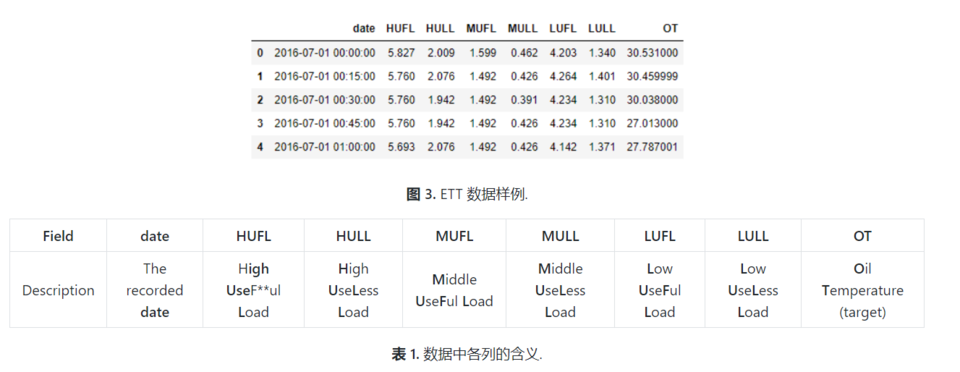
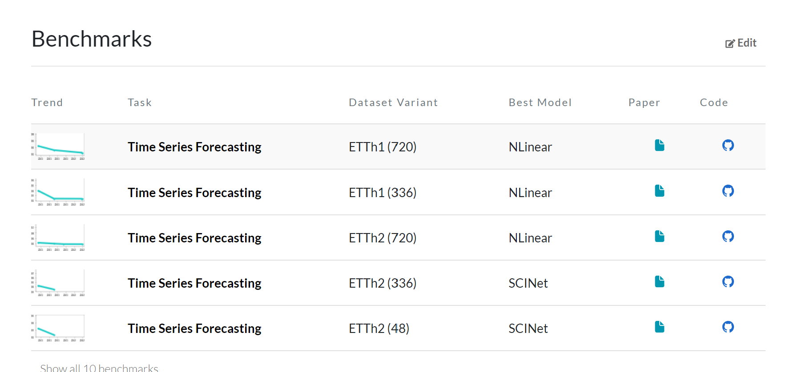

# BPETST

### This is an offical implementation of BPETST.

## Key Designs

:star2: **Byte Pair Encoding**: segmentation of time series are encoded into new tokens which are served as input tokens to Transformer.

## 项目目录
```
BPETST
│   README.md  
│
└───data_provider
│   │   data_factory.py
│   │   data_loader.py
│  
└───dataset
│   │   ETTh1.csv
│   │   ETTh2.csv
│   │   ...
│   
└───exp
│    │   exp_basic.py
│  
└───layers
│       │   BPETST_backbone.py
│       │   Discretization.py
│       │   Embed.py
│  
└───utils
│       │   masking.py
│       │   metrics.py
│       │   timefeatures.py
│       │   tools.py

```
TODO: 
- [x] 特征数据离散化
- [x] 时序特征进行BPE嵌入
- [ ] 实现Vanilla Time Series Transformer 模型
- [ ] 监督训练
- [ ] 实现带置信度判断的TST模型
- [ ] 用演化算符替代Attention机制
- [ ] 获取大量不同类型时序数据集
- [ ] 自监督预训练
- [ ] 消融实验
## Dataset 数据集介绍
###电力变压器数据集 (ETDataset)

该数据集提供了两年的数据，每个数据点每分钟记录一次（用 m 标记），它们分别来自中国同一个省的两个不同地区，分别名为ETTm1和ETTm2。每个数据集包含2年 365天 24小时 60分钟 = 1,051,200数据点。 此外，还提供一个小时级别粒度的数据集变体使用（用 h* 标记），即ETTh1和ETTh2。 每个数据点均包含8维特征，包括数据点的记录日期、预测值“油温”以及6个不同类型的外部负载值。

###Time Series Forecasting on ETT Benchmarks


## Getting Started
### def data_factory.data_provider(args, flag)
该方法是读取数据集并划分训练集，测试集以及验证集并生成对应的dataset类以及DataLoader类

### class layers.Discretization.Discretization

### class layers.Discretization.BPEEncode_Channel_Splitting

